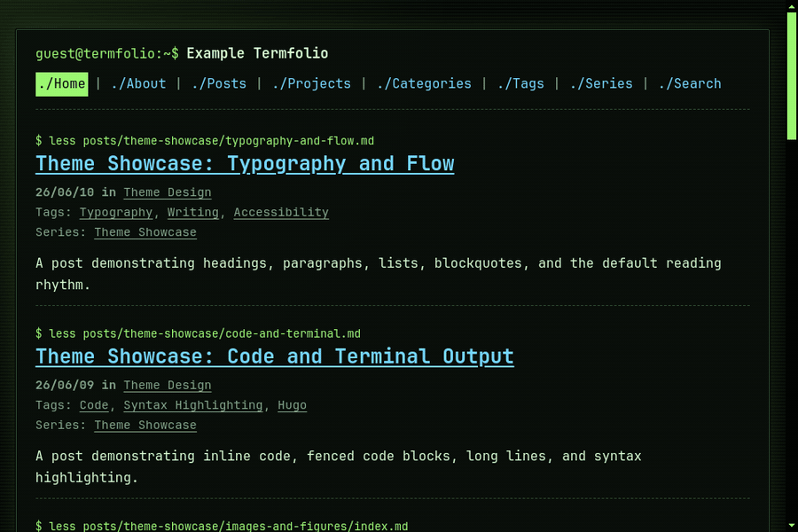
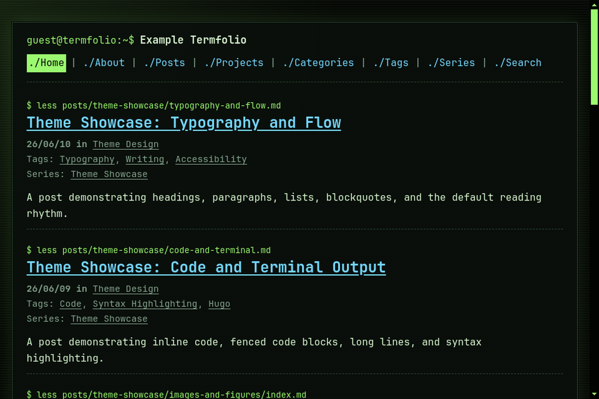
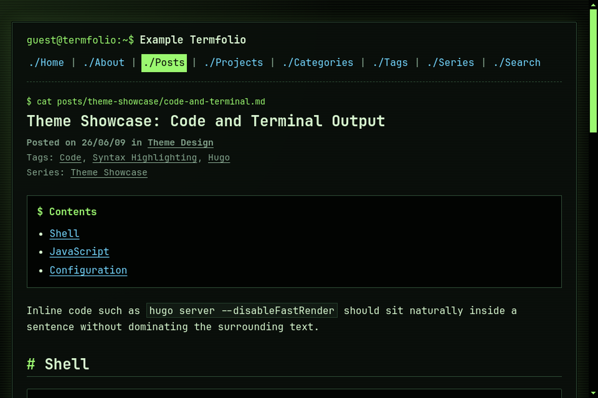
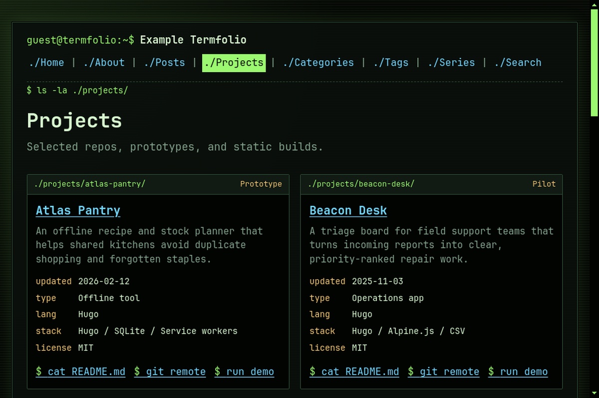
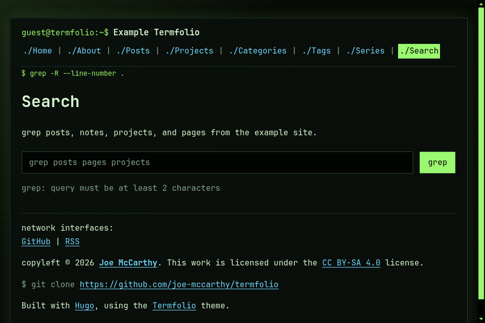

# Termfolio 🖥️


A dark, terminal-inspired Hugo theme for technical blogs, project portfolios, and repo-style personal sites.

Termfolio makes a static site feel like a browsable working directory: shell prompts, file-list navigation, project metadata, readable prose, local fonts, and privacy-first defaults.



The walkthrough shows list pages, project cards, code-heavy writing, and static search without loading third-party runtime assets.

[Live Demo](https://joe-mccarthy.github.io/termfolio/) · [Screenshots](#screenshots) · [Quick Start](#quick-start) · [Configuration](#configuration) · [Releases](https://github.com/joe-mccarthy/termfolio/releases)


## ✨ Why Termfolio?

Termfolio is built for people who want a personal site that feels technical, fast, and intentional without becoming a JavaScript app.

| What | Why it helps |
| --- | --- |
| 🧑‍💻 Terminal interface | Shell prompts, command-style section labels, and file-list navigation make the site feel like a readable repo. |
| 🌑 Dark-only design | The terminal palette stays consistent across browsers and operating-system themes. |
| 🔒 Privacy-first defaults | No analytics, cookies, comments, tracking, CDN fonts, or runtime external dependencies. |
| ⚡ No JavaScript by default | Regular pages ship as Hugo-rendered HTML and CSS unless optional search is enabled. |
| 📚 Strong writing defaults | Comfortable prose, footnotes, tables, figures, blockquotes, code blocks, and Chroma highlighting. |
| 🗂️ Portfolio-ready projects | Project pages support stack, status, role, impact, demo, repo, license, and year metadata. |
| 🔎 Optional static search | Use the built-in lightweight search for small sites or Pagefind for larger sites. |
| 🧭 Metadata included | JSON-LD, Open Graph, Twitter cards, canonical URLs, active nav state, RSS, and taxonomy pages. |

<a id="screenshots"></a>

## 📸 Screenshots

| Home | Post |
| --- | --- |
|  |  |

| Projects | Search |
| --- | --- |
|  |  |

## ✅ Requirements

* Hugo `0.128.0` or newer.
* Hugo Extended is not required.
* Git, if installing as a submodule.
* YAML, TOML, and JSON Hugo configs are supported; examples below use YAML.
* Pagefind is optional and only needed if you choose `params.search.provider: pagefind`.

## 🎯 Who It Is For

Termfolio is a good fit for:

* technical blogs and engineering notebooks
* personal portfolio sites with project write-ups
* repo indexes, changelogs, and small documentation hubs
* privacy-focused sites that should not load third-party runtime assets
* writers who want code, metadata, and prose to share one visual system

It is probably not the right fit for:

* light-theme-first sites
* image-heavy magazines
* marketing pages that need hero art, animation, and conversion sections
* sites that rely on large client-side interactions

## ♿ Accessibility

Termfolio keeps the interface minimal without hiding basic usability affordances:

* semantic HTML landmarks and headings
* skip links for keyboard users
* visible focus states
* active navigation state
* high-contrast dark palette
* readable line length through `params.style.maxWidth`
* no JavaScript requirement for ordinary reading and navigation

## ⚡ Performance

The default theme path is intentionally small:

* Hugo renders regular pages to static HTML.
* JetBrains Mono is bundled locally.
* CSS is served from the site, not a CDN.
* No analytics, comments, remote embeds, or tracking scripts are included.
* JavaScript only appears when optional static search is enabled.

Run your own production check after adding content and custom assets:

```bash
hugo --minify
```

Then test the generated `public/` output with your preferred Lighthouse or PageSpeed workflow.

Local example build baseline:

| Check | Current value |
| --- | --- |
| External JavaScript files | `0` |
| Theme CSS | `14.7 KB` |
| Home page HTML | `16.0 KB` |
| Bundled fonts | `392 KB` |
| Full example build | `4.3 MB`, including demo screenshots and GIF assets |

## 🌐 Sites Using Termfolio

Using Termfolio in public? Open a showcase issue or pull request and add your site here.

* [Example Termfolio](https://joe-mccarthy.github.io/termfolio/) - the bundled demo site.

Showcase submissions use the `showcase` issue template so permission and links are clear.

<a id="quick-start"></a>

## 🚀 Quick Start

Copy-paste this to create a new Hugo site with Termfolio:

```bash
hugo new site mysite -f yaml
cd mysite
git init
git submodule add https://github.com/joe-mccarthy/termfolio themes/termfolio
cat > config.yaml <<'EOF'
baseURL: https://example.org/
languageCode: en-gb
title: My Termfolio Site
theme: termfolio

pagination.pagerSize: 10

markup:
  highlight:
    noClasses: false

menu:
  main:
  - identifier: home
    name: Home
    url: /
    weight: 1
  - identifier: posts
    name: Posts
    url: /posts/
    weight: 2

params:
  author: Your Name
  description: "A short description for metadata and social previews."
  mainSections:
  - posts
  style:
    accentColor: "#9bf870"
  display:
    footerAttribution: true
    taxonomyMeta: true
EOF
hugo new content/posts/hello-terminal.md
hugo server
```

You should now see a dark shell-style Hugo site at [http://localhost:1313/](http://localhost:1313/).

## 🧪 Starter Site Shortcut

Want a working content set before you write your own pages? Copy the example site out of this repository:

```bash
git clone https://github.com/joe-mccarthy/termfolio termfolio-theme
cp -R termfolio-theme/example-site mysite
cd mysite
git init
mkdir -p themes
cp -R ../termfolio-theme themes/termfolio
perl -0pi -e 's/theme: \.\.\/\./theme: termfolio/' config.yaml
hugo server
```

This gives you posts, projects, search, taxonomies, and theme configuration to edit in place.

## 🔗 Example Pages

Use the demo to inspect real rendered pages:

* [Home](https://joe-mccarthy.github.io/termfolio/)
* [Posts](https://joe-mccarthy.github.io/termfolio/posts/)
* [Projects](https://joe-mccarthy.github.io/termfolio/projects/)
* [Code and terminal post](https://joe-mccarthy.github.io/termfolio/posts/theme-showcase/code-and-terminal/)
* [Search](https://joe-mccarthy.github.io/termfolio/search/)
* [Theme design category](https://joe-mccarthy.github.io/termfolio/categories/theme-design/)

## 👀 Run the Example Site Locally

```bash
git clone https://github.com/joe-mccarthy/termfolio
cd termfolio/example-site
hugo server --themesDir ../.. --theme termfolio
```

Visit [http://localhost:1313/termfolio/](http://localhost:1313/termfolio/).

## 📦 Installation

### Git Submodule

Recommended for most Hugo sites:

```bash
git submodule add https://github.com/joe-mccarthy/termfolio themes/termfolio
```

Then configure Hugo:

```yaml
theme: termfolio
```

To update later:

```bash
git submodule update --remote --merge
```

### Release Download

1. Download the [latest release](https://github.com/joe-mccarthy/termfolio/releases/latest).
2. Extract it into your site's `themes/termfolio` directory.
3. Set `theme: termfolio` in your Hugo config.

<a id="configuration"></a>

## ⚙️ Configuration

Start small and add options as your site grows:

```yaml
baseURL: https://example.org/
languageCode: en-gb
title: Site Title
theme: termfolio

pagination.pagerSize: 10

markup:
  highlight:
    noClasses: false

params:
  author: Blog Author
  description: "A short description for metadata and social previews."
  sourceURL: https://github.com/your-name/your-site
  mainSections:
  - posts
  style:
    maxWidth: 820px
    accentColor: "#9cd4c2"
  display:
    footerAttribution: true
    taxonomyMeta: true
  toc:
    enabled: true
    title: Contents
  latest:
    enabled: true
    count: 3
  post_nav:
    enabled: true
    show_title: false
```

### Navigation

```yaml
menu:
  main:
  - identifier: home
    name: Home
    url: /
    weight: 1
  - identifier: posts
    name: Posts
    url: /posts/
    weight: 2
  - identifier: projects
    name: Projects
    url: /projects/
    weight: 3
  - identifier: categories
    name: Categories
    url: /categories/
    weight: 4
  - identifier: tags
    name: Tags
    url: /tags/
    weight: 5
  - identifier: series
    name: Series
    url: /series/
    weight: 6
  - identifier: search
    name: Search
    url: /search/
    weight: 7
```

### Taxonomies

```yaml
taxonomies:
  category: categories
  tag: tags
  series: series
```

Termfolio ships layouts for categories, tags, and series. Add custom taxonomy layouts in your site if you define additional taxonomies.

### Common Parameters

| Parameter | Purpose |
| --- | --- |
| `params.author` | Author name shown in metadata and footer context. |
| `params.description` | Default page description for metadata. |
| `params.images` | Default Open Graph and Twitter card images. |
| `params.prompt` | Shell prompt text in the site header. |
| `params.sourceURL` | Repository/source link shown in the footer. |
| `params.mainSections` | Content sections shown on index-style lists. |
| `params.style.maxWidth` | Main layout width, such as `820px` or `1200px`. |
| `params.style.accentColor` | Primary accent color for links, prompts, and active states. |
| `params.customStylesheets` | Extra site CSS files loaded after the theme stylesheet. |
| `params.display.footerAttribution` | Shows or hides the Hugo/Termfolio footer attribution. |
| `params.display.taxonomyMeta` | Shows or hides taxonomy metadata near post titles. |
| `params.toc.enabled` | Enables table of contents blocks on single pages with headings. |
| `params.latest.enabled` | Enables latest-post lists on single content pages. |
| `params.post_nav.enabled` | Enables previous/next links on posts and projects. |
| `params.post_nav.show_title` | Shows neighboring post/project titles in previous/next links. |
| `params.search.enabled` | Enables the optional search page behavior. |
| `params.search.provider` | Use `simple` or `pagefind`. |
| `params.license.name` | Content license name shown in the footer. |
| `params.license.url` | Content license link shown in the footer. |
| `params.social` | Footer social links such as GitHub and RSS. |
| `params.abbrDateFmt` | Short date format for list metadata. |
| `params.dateFmt` | Full date format for content metadata. |

Date formats use Go's reference time syntax:

```yaml
params:
  abbrDateFmt: "01/02"
  dateFmt: "06/01/02"
```

## 🎨 Styling

Termfolio is intentionally dark-only. The default palette is high contrast and terminal-inspired.

### Change the Accent Color

Most sites can feel customized with one line:

```yaml
params:
  style:
    accentColor: "#75d7ff"
```

### Override the Full Palette

```yaml
params:
  style:
    maxWidth: 1200px
    bgColor: "#050705"
    fontColor: "#d8f8d0"
    mutedColor: "#83a38c"
    linkColor: "#75d7ff"
    visitedColor: "#d7a8ff"
    accentColor: "#9bf870"
    borderColor: "#2d4a34"
    preColor: "#eaffdf"
    preBgColor: "#020402"
    codeBgColor: "#111a13"
```

### Add Custom CSS

```yaml
params:
  customStylesheets:
  - css/custom.css
```

```css
/* static/css/custom.css */
.site-header {
  border-color: #9bf870;
}
```

## 📝 Content

Termfolio works best with a simple content tree:

```text
content/
├── posts/
├── projects/
├── search/
│   └── index.md
└── about/
    └── index.md
```

### Posts

```yaml
---
title: "My First Post"
date: 2026-07-16T10:00:00Z
draft: false
summary: "A short summary for lists and search results."
categories: ["theme design"]
tags: ["hugo", "writing"]
series: ["Getting Started"]
toc: true
images:
- posts/my-first-post/cover.jpg
---
```

### Projects

Projects get a repo-style layout with structured metadata:

```yaml
---
title: "Atlas Pantry"
date: 2026-02-12T09:00:00Z
draft: false
summary: "An offline recipe and stock planner for shared kitchens."
subtitle: "A static project page with useful metadata."
year: 2026
projectType: "Offline tool"
status: "Prototype"
license: "MIT"
role: "Product design"
impact: "Shared kitchen planning"
stack: ["Hugo", "SQLite", "Service workers"]
demo: "https://example.org/projects/atlas-pantry"
repo: "https://example.org/repos/atlas-pantry"
---

## Problem

## Approach

## Result
```

Create a new project page with:

```bash
hugo new content/projects/my-project/index.md
```

## 🧩 Shortcodes

Termfolio includes a few small shortcodes for common content patterns:

```markdown



Short supporting text.



Hidden-by-default details.



```

Markdown images scale with the content column by default. Use the `figure` shortcode when you need a caption.

## 🔎 Search

Search is optional and off by default.

### Built-In Search

The `simple` provider builds a small client-side index from regular Hugo pages:

```yaml
params:
  search:
    enabled: true
    provider: simple
```

Create `content/search/index.md`:

```yaml
---
title: Search
layout: search
---
```

### Pagefind

For larger sites:

```yaml
params:
  search:
    enabled: true
    provider: pagefind
```

Build the site, then run Pagefind against the generated output:

```bash
hugo
pagefind --site public
```

The Pagefind provider loads `/pagefind/pagefind-ui.css` and `/pagefind/pagefind-ui.js` from your own site.

## 🧾 Latest Changes

`v1.0.0-rc.1` includes:

* standalone Termfolio split as a Hugo theme
* terminal-inspired layout and file-list navigation
* repo-style project pages
* static search support
* SEO/social metadata
* bundled JetBrains Mono assets
* README walkthrough GIF, screenshots, and adoption-focused quick start documentation
* Hugo Themes gallery assets and submission checklist
* GitHub issue templates for bugs, feature requests, and showcase submissions
* dark-only palette simplification

See [CHANGELOG.md](CHANGELOG.md) and the [Releases](https://github.com/joe-mccarthy/termfolio/releases) page for version history.

## 🗃️ Repository Map

```text
termfolio/
├── archetypes/         # Templates for new content
├── docs/               # Release and Hugo Themes submission checklists
├── example-site/       # Demo site and showcase content
├── images/             # Hugo theme gallery screenshot and thumbnail
├── layouts/            # Hugo templates and partials
├── static/             # CSS, fonts, icons, screenshots, and GIF assets
├── hugo.toml           # Supported Hugo version metadata
└── theme.toml          # Hugo theme gallery metadata
```

## 🛠️ Development

Run the example site while editing the theme:

```bash
hugo server --source example-site --themesDir ../.. --theme termfolio
```

Build the example site:

```bash
hugo --source example-site --themesDir ../.. --theme termfolio
```

Theme gallery metadata lives in `theme.toml`; gallery assets live in `images/screenshot.png` and `images/tn.png`.

## 🧭 Hugo Themes Readiness

This repository includes the files expected by the Hugo Themes gallery:

* `theme.toml` metadata with `demosite`, tags, features, author, license, and Hugo version support.
* `hugo.toml` with the supported Hugo version range.
* `images/screenshot.png` at `1500x1000`, using the required 3:2 aspect ratio.
* `images/tn.png` at `900x600`, using the required 3:2 aspect ratio.
* Additional README media lives under `static/images/`.

See [docs/hugo-themes-submission.md](docs/hugo-themes-submission.md) for the submission checklist. To submit Termfolio, add `github.com/joe-mccarthy/termfolio` to `themes.txt` in the Hugo Themes Site Builder repository and open a pull request.

## 🚢 Release Assets

For each release, include or verify:

* `static/images/termfolio-example.gif`
* `static/images/screenshots/home.png`
* `static/images/screenshots/post.png`
* `static/images/screenshots/projects.png`
* `static/images/screenshots/search.png`
* `images/screenshot.png`
* `images/tn.png`

The Hugo Themes build can use metadata and images from the latest release, so tag a new release after changing screenshots or theme metadata.

See [docs/release-checklist.md](docs/release-checklist.md) for the full release checklist.

## 🧯 Troubleshooting

| Problem | Check |
| --- | --- |
| Theme is not loading | Confirm `theme: termfolio` and that the theme is in `themes/termfolio`. |
| Styles look incomplete | Make sure `static/css/termfolio.css` is available and custom CSS is not overriding core tokens unexpectedly. |
| Code highlighting looks plain | Set `markup.highlight.noClasses: false` so Hugo emits Chroma classes. |
| Content is missing | Check that pages are not `draft: true`, or run Hugo with `--buildDrafts`. |
| Search page is blank | Confirm `params.search.enabled: true`, `layout: search`, and the selected provider. |

## 🤝 Contributing

Contributions are welcome. Keep changes focused, test the example site, and update documentation when behavior changes.

```bash
git checkout -b my-new-feature
hugo --source example-site --themesDir ../.. --theme termfolio
```

Then open a pull request with a clear description of the change and any screenshots that help reviewers.

## 📄 License

Termfolio is released under the [MIT License](LICENSE).

## 🙏 Acknowledgements

* [Hugo](https://gohugo.io/) powers the static site pipeline.
* [JetBrains Mono](https://www.jetbrains.com/lp/mono/) provides the bundled terminal-style typeface.

## 🗓️ Releases

See the [Releases](https://github.com/joe-mccarthy/termfolio/releases) page for changelog and version history.
